<h2>Design Pattern Adapter</h2>
<h3>Présentation du Pattern Adapter</h3>
Le <strong>pattern Adapter (Adaptateur en français)</strong> est un design pattern de conception structurel qui permet à des interfaces incompatibles de travailler ensemble. Il agit comme un pont entre deux interfaces différentes, les rendants compatibles sans modifier leur code source.

<h3>Analogie avec le monde réel</h3>
Imaginons que vous vouliez faire un branchement vidéo : 
<ul>
<li>Le Client (Ordinateur) : Possède une sortie VGA (Interface Standard).</li>
<li>L'Adapté (Vidéo Projecteur / TV) : Possède une entrée HDMI (Interface Incompatible).</li>
<li>L'Adaptateur : Un petit boîtier (Dongle) qui se branche sur le VGA d'un côté et accepte le HDMI de l'autre, convertissant ainsi le signal entre le Client et l'Adapté.
</li>
</ul>

<h3>Structure</h3>
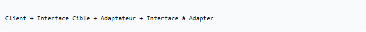
 

<h3>Implémentation Types</h3>
 
<ol>
<li>L'interface cible / Target - Vga.java</li>
 
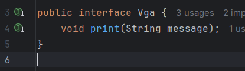
 
 
<li>Le Client / - uniteCentrale.java</li>
 
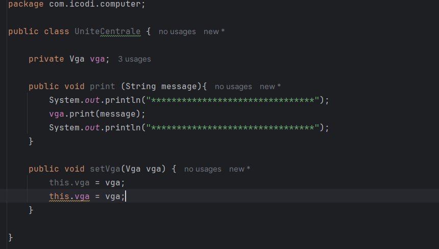
 
 
<li>Implémentation standard 1 / - Ecran.java</li>
 
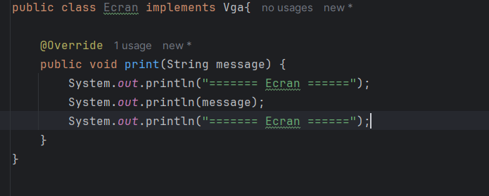
 
 
<li>Implémentation standard 2 / - VideoProjecteur.java</li>
 
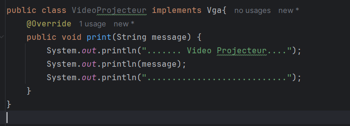
 
 
<li>L'interface incompatible / - Hdmi.java</li>
 
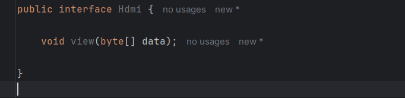
 
 
<li>L'implémentation à adapter / - TV.java</li>
 
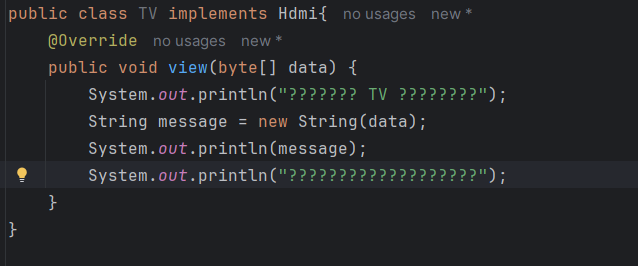
 
 
<li>La solution - Le pont / adapter</li>
 
<ol>
<li>Adaptateur par Héritage (Inheritance) / HdmiVgaAdapterH.java</li>
 
L'adaptateur hérite de la classe à adapter et implémente l'interface cible.
<strong>Avantage : </strong> Permet de redéfinir certaines méthodes de l'adapté.
<strong> Inconvénient :</strong> Moins flexible (couplage fort), impossible en Java si on doit hériter d'une autre classe (héritage multiple interdit).
 
 
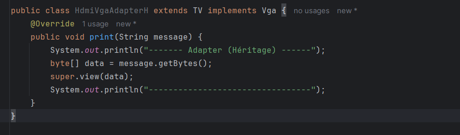
 
 
<li>Classe principale pour tester / Main.java</li>
 
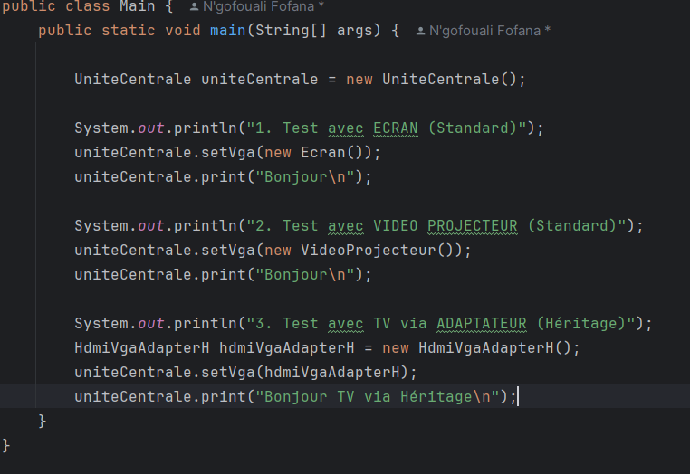
 
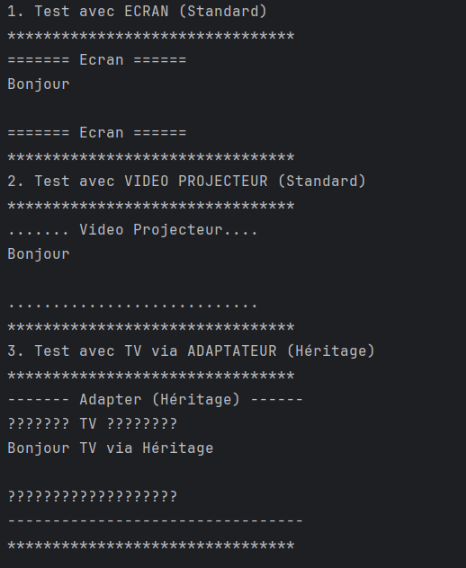
 
<li>Adaptateur par Composition / HdmiVgaAdapter.java</li>
 
L'adaptateur implémente l'interface cible et possède un attribut (une instance) de la classe à adapter.
<strong>Avantage :</strong> Plus souple, respecte le principe de "Préférer la composition à l'héritage". Permet d'adapter dynamiquement n'importe quelle sous-classe de l'adapté.
 
 
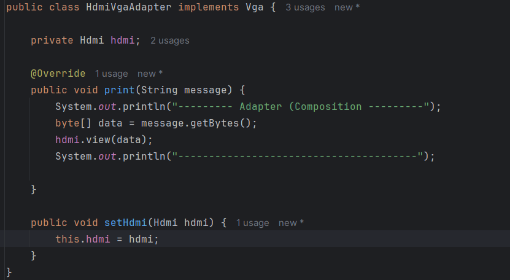
 
 
<li>Classe principale pour tester / Main.java</li>
 
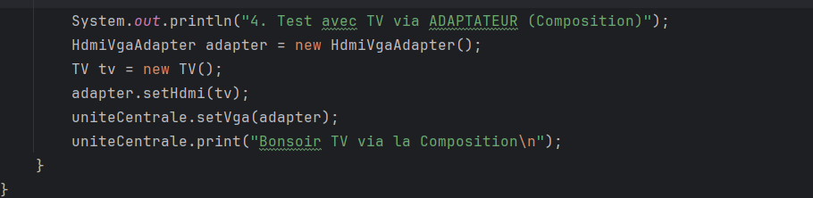
 
 
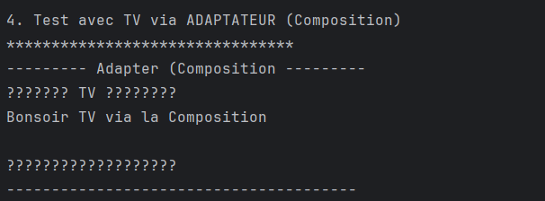

</ol>
</ol>
